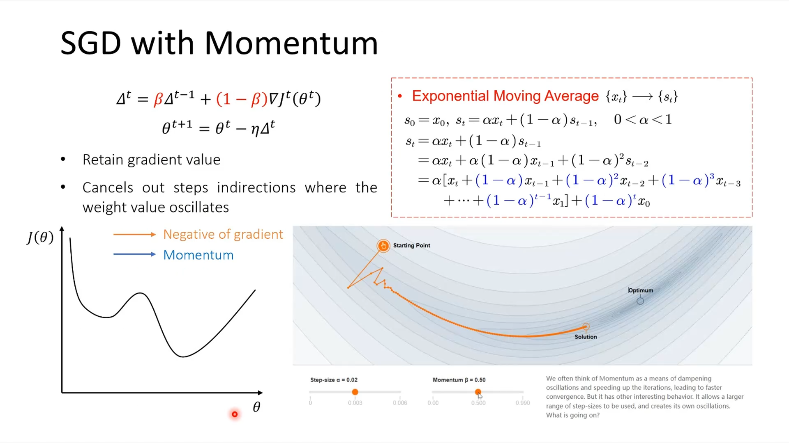

# Chap 06. 与学习相关的技巧

SGD 的缺点是，如果函数的形状非均向 (anisotropic)，比如呈延伸状，搜索的路径就会非常低效。 
SGD 低效的根本原因是，梯度的方向并没有指向最小值的方向。 
使用 Momentum、AdaGrad、Adam 这 3 种方法来取代 SGD。

## Momentum

## AdaGrad
在梯度大的方向 -> 步子缩小; 在梯度小的方向 -> 步子放大。

## 权重标准差
标准差为 1 时，激活函数的输出值集中在0与1附近，梯度消失（因为0与1附近导数值很小）； 
标准差为 0.01 时，激活函数的输出值集中在0.5附近，表现力受限。
当激活函数使用 `ReLU` 时，权重初始值使用 He 初始值，当激活函数为 `sigmoid` 或 tanh 等 S 型曲线函数时，初始值使用 Xavier 初始值。
这是目前的最佳实践。

## Batch Normalization
$$ \mu_B \leftarrow \frac{1}{m} \sum_{i=1}^m x_i $$
$$ \sigma_B^2 \leftarrow \frac{1}{m} \sum_{i=1}^m (x_i - \mu_B)^2 $$
$$ \hat{x}_i \leftarrow \frac{x_i - \mu_B}{\sqrt{\sigma_B^2 + \varepsilon}} $$

## 超参数的验证
- 步骤 0 
设定超参数的范围。
- 步骤 1 
从设定的超参数范围中随机采样。
- 步骤 2 
使用步骤 1 中采样到的超参数的值进行学习，通过验证数据评估识别精度（但是要将 epoch 设置得很小） 。
- 步骤 3 
重复步骤 1 和步骤 2 （100 次等），根据它们的识别精度的结果，缩小超参数的范围。