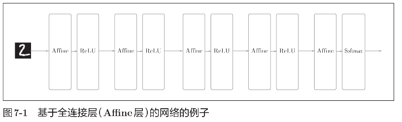
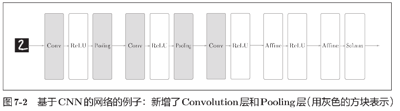
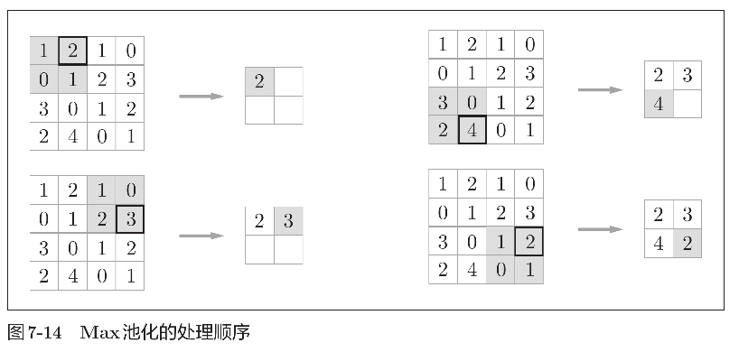
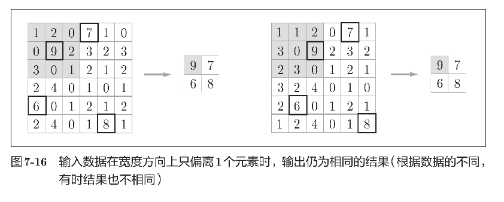

# Chap 07. 卷积神经网络
## 7.1. 整体结构
CNN 中新出现了卷积层（`Convolution` 层）和池化层（`Pooling` 层）。

全连接神经网络和卷积神经网络对比：



## 7.2. 卷积层
卷积运算相当于图像处理中的“滤波器运算”。

例子：
$$
\left[\begin{matrix}
    1, 2, 3, 0\\
    0, 1, 2, 3\\
    3, 0, 1, 2\\
    2, 3, 0, 1
\end{matrix}\right]
\mathrm{卷积}
\left[\begin{matrix}
    2, 0, 1\\
    0, 1, 2\\
    1, 0, 2
\end{matrix}\right]
=
\left[\begin{matrix}
    15, 16\\
    6, 15
\end{matrix}\right]
$$

为了防止矩阵规模越算越小，经常在矩阵外围填充（padding）一些 $0$。

假设输入大小为 $(H, W)$，滤波器大小为 $(FH, FW)$，输出大小为 $(OH, OW)$，填充为 $P$，步幅为 $S$。此时，输出大小可通过下式进行计算。
$$
\begin{align*}
OH &= \frac{H + 2P - FH}{S} + 1,\\
OW &= \frac{W + 2P - FW}{S} + 1.
\end{align*}
$$

对于多通道数据，结果为将对应位置各通道卷积结果进行相加后输出。<br>
需要注意的是，在多维数据的卷积运算中，输入数据和滤波器的通道数要设为相同的值。

比如，通道数为 $C$、高度为 $H$、长度为 $W$ 的数据的形状可以写成 $(C, H, W)$ 。滤波器也一样，要按 (channel, height, width) 的顺序书写。比如，通道数为 $C$、滤波器高度为 $FH$ （Filter Height）、长度为 $FW$ （Filter Width）时，可以写成 $(C, FH, FW)$。

通过应用 $FN$ 个滤波器，输出特征图也生成了 $FN$ 个。如果将这 $FN$ 个特征图汇集在一起，就得到了形状为 $(FN, OH, OW)$ 的方块。将这个方块传给下一层，就是 CNN 的处理流。<br>
因此，作为 4 维数据，滤波器的权重数据要按 `(output_channel, input_channel, height, width)` 的顺序书写。比如，通道数为 $3$、大小为 $5 × 5$ 的滤波器有 $20$ 个时，可以写成 `(20, 3, 5, 5)`。

按 `(batch_num, channel, height, width)` 的顺序保存数据以进行批处理。

## 7.3. 池化层


一般来说，池化的窗口大小会和步幅设定成相同的值。

除了 Max 池化之外，还有 Average 池化等。在图像识别领域，主要使用 Max 池化。

池化层的特征：
- 没有要学习的参数<br>
池化层和卷积层不同，没有要学习的参数。池化只是从目标区域中取最大值（或者平均值），所以不存在要学习的参数。
- 通道数不发生变化<br>
经过池化运算，输入数据和输出数据的通道数不会发生变化。
- 对微小的位置变化具有鲁棒性（健壮）<br>
输入数据发生微小偏差时，池化仍会返回相同的结果。因此，池化对
输入数据的微小偏差具有鲁棒性。比如，$3 × 3$ 的池化的情况下，如图
7-16 所示，池化会吸收输入数据的偏差（根据数据的不同，结果有可
能不一致）。


## 7.4. 卷积层和池化层的实现
### 7.4.3. 卷积层的实现
本书提供了 im2col 函数，并将这个 im2col 函数作为黑盒（不关心内部实现）使用。im2col 的实现内容在 common/util.py 中，它的实现（实质上）是一个 10
行左右的简单函数。
im2col 这一便捷函数具有以下接口。
```Python
im2col(input_data, filter_h, filter_w, stride=1, pad=0)
input_data      # 由（ 数据量，通道，高，长 ）的4 维数组构成的输入数据
filter_h        # 滤波器的高
filter_w        # 滤波器的长
stride          # 步幅
pad             # 填充
```
